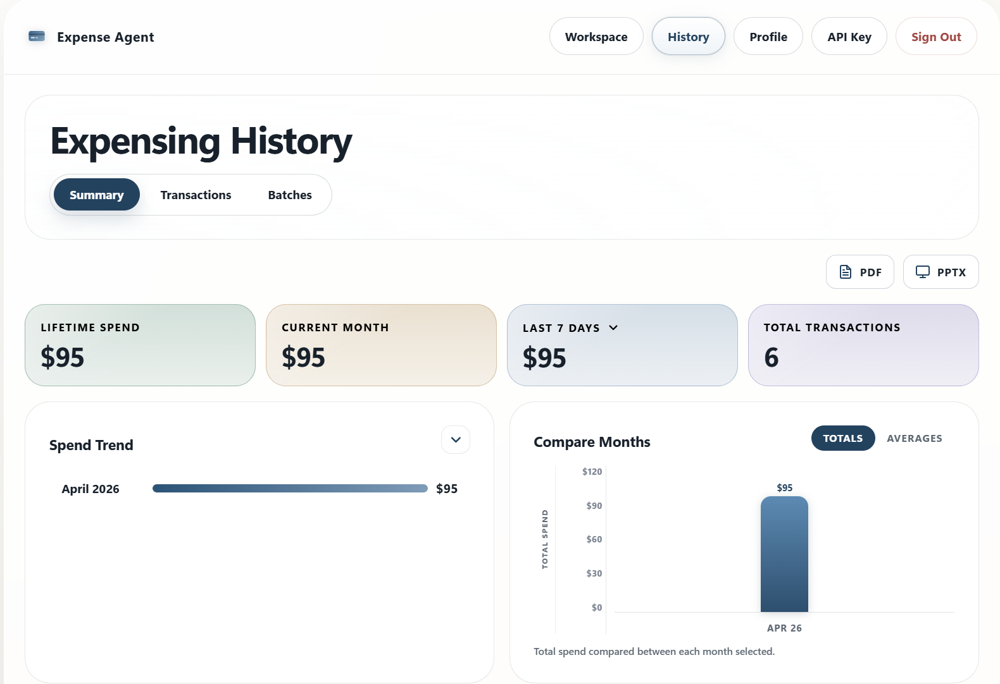

# Compline

Compline turns credit card app screenshots into a reviewed expense log.

Live app: [expenseagent.aviralagarwal.com](https://expenseagent.aviralagarwal.com)



## Overview

Most expense tools force one of two extremes: fully manual entry, or full automatic import across every account. Compline is built for the middle ground.

The app lets a user intentionally upload batches of screenshots from credit card apps, extract the visible transactions, compare them against prior history, and confirm what should actually be saved. The result is one reviewed ledger across multiple cards without direct bank integrations.

The live app ships with a hosted demo path: visitors can sign in and start uploading immediately with up to 10 screenshots per day, with no provider account or API key of their own. Power users and self-hosters can plug in a personal Anthropic, OpenAI, or Gemini key at any time and route their usage through their own provider account.

## What It Does

- Google sign-in through Supabase
- Hosted demo path so new visitors can try the live app instantly with included credits, capped at 10 screenshots per day on the public deployment
- Optional personal Anthropic, OpenAI, or Gemini API key for direct provider usage
- Saved credit card labels with optional identifying digits
- Screenshot upload and provider-selectable vision extraction
- Exact and fuzzy duplicate detection
- Confirmation step before insertion
- Unified transaction history across cards
- Summary, transaction, and batch history views
- Per-transaction notes for user context
- CSV export for transactions and batches
- Browser PDF/print and PPTX summary export from the history page

## Typical Flow

1. Sign in with Google.
2. Save at least one credit card label. (No personal API key required when hosted credits are enabled; that step becomes optional and lives on the API Key page for users who want to bring their own provider account.)
3. Upload one or more screenshots from a credit card app.
4. Review new transactions, skipped duplicates, and possible duplicates.
5. Confirm the rows that should be written to history.
6. Review everything later in the history views.

Each upload is tied to one selected credit card, but all confirmed rows are written into the same per-user ledger. The workspace selector lets users pick between hosted credits and any personal keys they have saved on a per-batch basis.

## Architecture

Compline is a small server-rendered web app with a deliberately simple stack.

- Backend: Python + Flask
- Frontend: HTML, CSS, and vanilla JavaScript
- AI extraction: provider-selectable vision LLMs
- Auth and data storage: Supabase
- Deployment: Docker, designed for Google Cloud Run

The app entry point is `app.py`, with backend domain logic split into the `expense_agent/` package. Templates live in `templates/`, and page assets live in `static/css/` and `static/js/`. There is no frontend build step, bundler, or client framework.

Configured extraction providers are Anthropic, OpenAI, and Gemini. Personal user keys are checked for plausible provider-specific formats before storage; Gemini accepts both Google AI Studio-style `AIza...` keys and Google Cloud-style `AQ....` keys.

Alongside the three real providers, the app exposes one synthetic provider id, `hosted`, for the server-funded hosted demo path. It is enabled when the deployment sets a single server-side key via `HOSTED_AI_API_KEY` (with `HOSTED_API_KEY` accepted as a legacy alias) and is resolved at request time to the underlying real provider; the literal string `"hosted"` is never sent to a vision model. The API metadata currently labels this synthetic entry "Compline Credits", while the workspace processing selector presents it as hosted usage. Each hosted upload reserves `len(files)` against a per-user daily quota stored inside the existing `user_settings` row; the public deployment uses a 10-screenshot daily limit. Once the quota is exhausted, `/upload` returns HTTP 429 without calling the provider. Self-hosters who want the original BYO-key-only behavior can simply leave `HOSTED_AI_API_KEY` blank. The hosted key is server-side only: it is never stored in Supabase, sent to the browser, or accepted on the in-app API key page.

## Data Model

The runtime uses two main persistence concepts:

- `user_settings`: stores the user's personal API keys, active provider, profile data, saved credit cards, and a small per-day hosted-quota counter in a single serialized settings blob
- `transactions`: stores confirmed expense rows, including vendor, card label, amount, date, status, optional `memo`, and optional `batch_id`

Batch history is derived from groups of transactions that share a `batch_id`. There is no separate batches table, and the hosted quota piggy-backs on the existing settings row instead of a separate usage table.

## Local Development

### Requirements

- Python 3.11
- A Supabase project with Google auth enabled
- An Anthropic, OpenAI, or Gemini account if you are not using hosted credits

### Setup

```bash
pip install -r requirements.txt
python app.py
```

Then create a local `.env` from `.env.example` and set:

- `SUPABASE_URL`
- `SUPABASE_SERVICE_KEY`
- `APP_URL`

For local development, this is sufficient:

```text
APP_URL=http://127.0.0.1:5000
```

To exercise the hosted demo flow locally, also set:

```text
HOSTED_AI_PROVIDER=anthropic
HOSTED_AI_API_KEY=your_provider_key_here
HOSTED_DAILY_SCREENSHOT_LIMIT=10
```

Leave `HOSTED_AI_API_KEY` blank (or omit it entirely) to keep the BYO-key-only behaviour.

In Supabase Auth, allow this callback URL:

```text
http://127.0.0.1:5000/auth/callback
```

## Tests

The repo includes a lightweight smoke suite for the most refactor-sensitive backend routes.
It also includes focused validation tests for provider API key format checks.

Run it with:

```bash
python -m unittest discover -s tests -v
```

Useful validation commands:

```bash
python -m compileall -q app.py expense_agent tests
node --check static/js/index.js
node --check static/js/history.js
node --check static/js/settings.js
node --check static/js/profile_settings.js
```

## Deployment Notes

The repository includes a `Dockerfile` and a helper script, `scripts/generate_cloudrun_env.py`, for generating a Cloud Run env-vars YAML from a local `.env` file.

Production expects:

- `SUPABASE_URL`
- `SUPABASE_SERVICE_KEY`
- `APP_URL`

Optional, for hosted demo credits in production:

- `HOSTED_AI_PROVIDER` (one of `anthropic`, `openai`, `gemini`)
- `HOSTED_AI_API_KEY`
- `HOSTED_DAILY_SCREENSHOT_LIMIT` (the public app uses `10`)

`APP_URL` should match the public origin used for Google OAuth callbacks. The hosted key should be created in a dedicated provider workspace/project with strict spend controls; rotate it if it is ever exposed.

## License

MIT. See [LICENSE](LICENSE).
