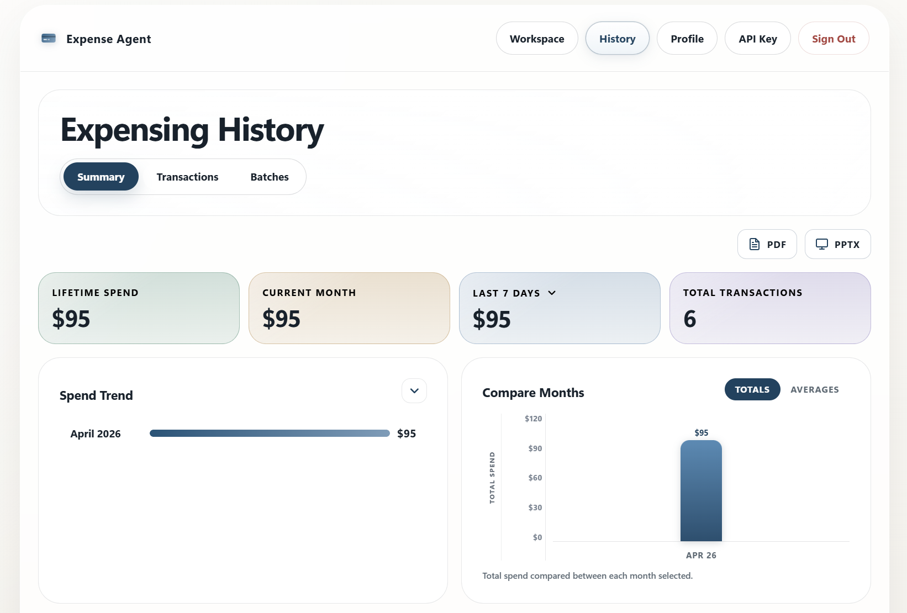

# Expense Agent

Expense Agent turns credit card app screenshots into a reviewed expense log.

Live app: [expenseagent.aviralagarwal.com](https://expenseagent.aviralagarwal.com)



## Overview

Most expense tools force one of two extremes: fully manual entry, or full automatic import across every account. Expense Agent is built for the middle ground.

The app lets a user intentionally upload batches of screenshots from credit card apps, extract the visible transactions, compare them against prior history, and confirm what should actually be saved. The result is one reviewed ledger across multiple cards without direct bank integrations.

## What It Does

- Google sign-in through Supabase
- User-supplied Anthropic API key
- Saved card labels with optional identifying digits
- Screenshot upload and Claude Vision extraction
- Exact and fuzzy duplicate detection
- Confirmation step before insertion
- Unified transaction history across cards
- Summary, transaction, and batch history views
- CSV export for transactions and batches
- PDF and PPTX-style summary export from the history page

## Typical Flow

1. Sign in with Google.
2. Save an Anthropic API key.
3. Save at least one card label.
4. Upload one or more screenshots from a credit card app.
5. Review new transactions, skipped duplicates, and possible duplicates.
6. Confirm the rows that should be written to history.
7. Review everything later in the history views.

Each upload is tied to one selected saved card, but all confirmed rows are written into the same per-user ledger.

## Architecture

Expense Agent is a small server-rendered web app with a deliberately simple stack.

- Backend: Python + Flask
- Frontend: HTML, CSS, and vanilla JavaScript
- AI extraction: Anthropic Claude Vision
- Auth and data storage: Supabase
- Deployment: Docker, designed for Google Cloud Run

The app entry point is `app.py`, with backend domain logic split into the `expense_agent/` package. Templates live in `templates/`, and page assets live in `static/css/` and `static/js/`. There is no frontend build step, bundler, or client framework.

## Data Model

The runtime uses two main persistence concepts:

- `user_settings`: stores the user's Anthropic API key, profile data, and saved cards in a serialized settings blob
- `transactions`: stores confirmed expense rows, including vendor, card label, amount, date, status, and optional `batch_id`

Batch history is derived from groups of transactions that share a `batch_id`. There is no separate batches table.

## Local Development

### Requirements

- Python 3.11
- A Supabase project with Google auth enabled
- An Anthropic account for screenshot extraction

### Setup

```bash
pip install -r requirements.txt
python app.py
```

Then create a local `.env` from `.env.example` and set:

- `SUPABASE_URL`
- `SUPABASE_SERVICE_KEY`
- `APP_URL`

For local development, this is sufficient:

```text
APP_URL=http://127.0.0.1:5000
```

In Supabase Auth, allow this callback URL:

```text
http://127.0.0.1:5000/auth/callback
```

## Tests

The repo includes a lightweight smoke suite for the most refactor-sensitive backend routes.

Run it with:

```bash
python -m unittest discover -s tests -v
```

Useful validation commands:

```bash
python -m py_compile app.py expense_agent/*.py tests/test_routes_smoke.py
node --check static/js/index.js
node --check static/js/history.js
```

## Deployment Notes

The repository includes a `Dockerfile` and a helper script, `scripts/generate_cloudrun_env.py`, for generating a Cloud Run env-vars YAML from a local `.env` file.

Production expects:

- `SUPABASE_URL`
- `SUPABASE_SERVICE_KEY`
- `APP_URL`

`APP_URL` should match the public origin used for Google OAuth callbacks.

## License

MIT. See [LICENSE](LICENSE).
