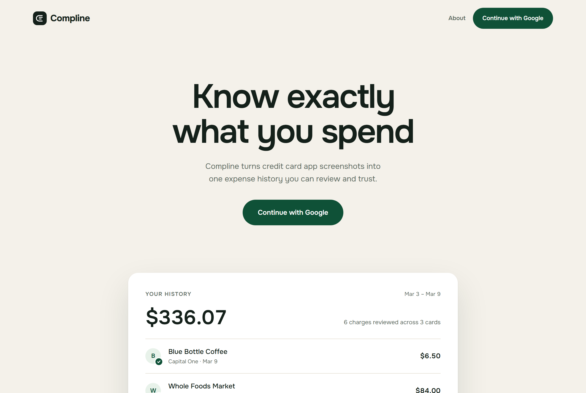

# Compline

Turn credit card app screenshots into one reviewed expense history.

Live: [compline.aviralagarwal.com](https://compline.aviralagarwal.com)



Each card app shows only its own charges. Compline sits between typing every charge into a spreadsheet and syncing every account automatically: you screenshot the charges your card apps already show you, Compline reads them and catches likely repeats, and nothing is saved to your history until you add it. No bank connection, no stored credentials.

## Features

- Google sign-in through Supabase.
- Upload up to 10 screenshots at a time, filed under one of your saved cards. Anthropic vision reads the charges.
- Duplicate checks against your history: exact repeats are skipped, and close matches (a day or a few cents apart) wait for you to add or skip.
- A history dashboard by year, month, and card, with every charge editable (merchant, date, amount, status, and a note).
- Delete a single charge or a whole upload.
- Export to CSV, print to PDF, or download a PowerPoint year summary.
- A daily per-user screenshot allowance, so one hosted Anthropic key can serve every user.
- Account deletion that removes all data and the sign-in.

## Stack

- Python and Flask, with server-rendered Jinja templates.
- Plain HTML, CSS, and JavaScript. No frontend framework or build step.
- Supabase for Google auth and Postgres.
- Anthropic's API for reading screenshots.
- Docker, deployed to Google Cloud Run.

## Getting started

You need Python 3.11, a [Supabase](https://supabase.com) project, a Google OAuth client, and an [Anthropic API key](https://console.anthropic.com).

1. **Install**

   ```bash
   python -m venv .venv
   source .venv/bin/activate   # Windows: .venv\Scripts\activate
   pip install -r requirements.txt
   ```

2. **Set up Supabase**

   - In the SQL editor, run [`supabase/schema.sql`](supabase/schema.sql). It creates the `transactions` and `user_settings` tables with row-level security on.
   - Under Authentication › Providers, enable Google with your OAuth client ID and secret.
   - Under Authentication › URL Configuration, add `http://127.0.0.1:5000/auth/callback` (and your production `/auth/callback`) as redirect URLs.

3. **Configure**

   ```bash
   cp .env.example .env
   ```

   | Variable | Required | Purpose |
   | --- | --- | --- |
   | `SUPABASE_URL` | Yes | Project URL (Settings › API). |
   | `SUPABASE_SERVICE_KEY` | Yes | Service-role key. Server only; never expose it to the browser. |
   | `APP_URL` | Yes | Public origin with no trailing slash, used for OAuth redirects. `http://127.0.0.1:5000` locally. |
   | `HOSTED_AI_API_KEY` | For uploads | Anthropic key used for every user. Without it, uploads are unavailable and everything else still works. |
   | `HOSTED_DAILY_SCREENSHOT_LIMIT` | No | Screenshots per user per UTC day. Defaults to `10`; `0` removes the limit. |
   | `AUTH_COOKIE_SECRET` | No | Signs the short-lived OAuth cookie. Defaults to the service key; set your own in production. |

4. **Run**

   ```bash
   python app.py
   ```

   Open [http://127.0.0.1:5000](http://127.0.0.1:5000).

## Tests

```bash
python -m unittest discover -s tests -v
python -m compileall -q app.py compline tests scripts
```

Browser scripts have no build step; `node --check static/js/<file>.js` catches syntax errors.

## Deploying

The `Dockerfile` runs the app with gunicorn on `$PORT`, which suits Cloud Run and most container hosts. Set the same environment variables on the service, and add the production `/auth/callback` URL in Supabase.

- `scripts/generate_cloudrun_env.py` builds a Cloud Run env-vars file from your local `.env`.
- `.github/workflows/deploy-cloud-run.yml` builds and deploys on every push to `main`. It is configured for the maintainer's Google Cloud project; change the project, region, service, and identity settings for your own.
- `.github/workflows/supabase-keep-alive.yml` pings `/api/health` every six hours so a free Supabase project is not paused for inactivity. Point it at your deployment with the `SUPABASE_KEEP_ALIVE_URL` repository variable.

Give the hosted Anthropic key its own workspace with spend limits, and rotate it if it is ever exposed.

## Project layout

```text
app.py              Flask app and routes
compline/           Extraction, duplicate checks, storage, cards, and settings
templates/          Jinja pages and partials
static/css, js/     Styles and page scripts (base.css holds the shared design tokens)
supabase/           Database schema
tests/              unittest suite
scripts/            Deployment helpers and the link-preview image source
```

## License

MIT. See [LICENSE](LICENSE).
